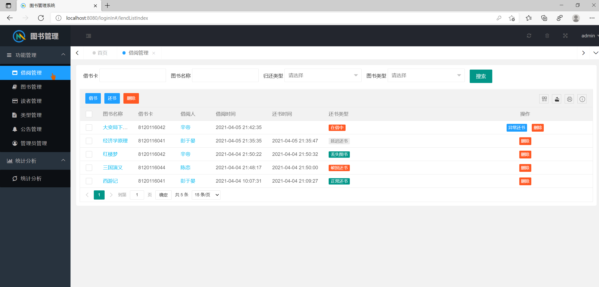
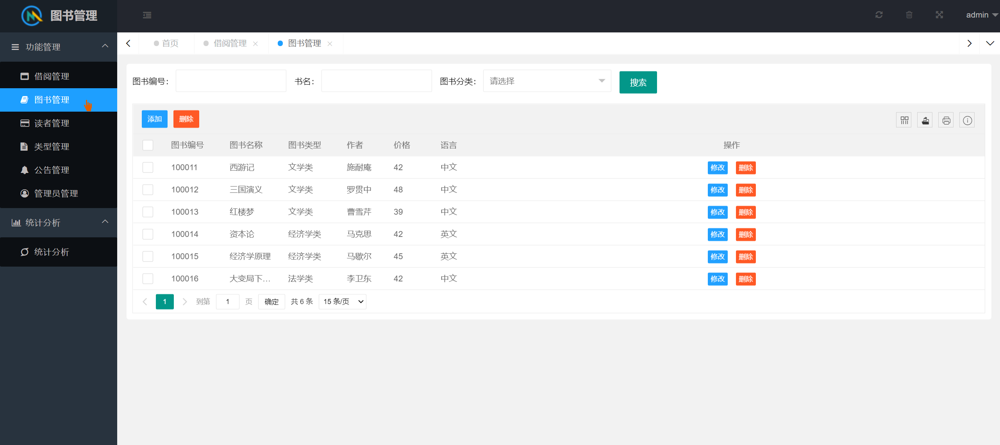
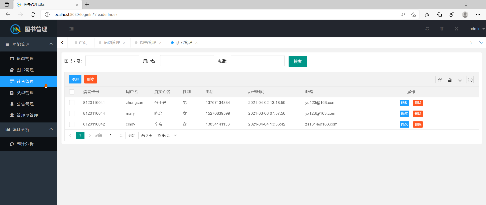
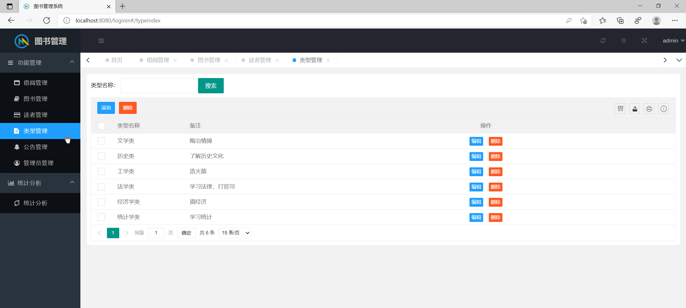
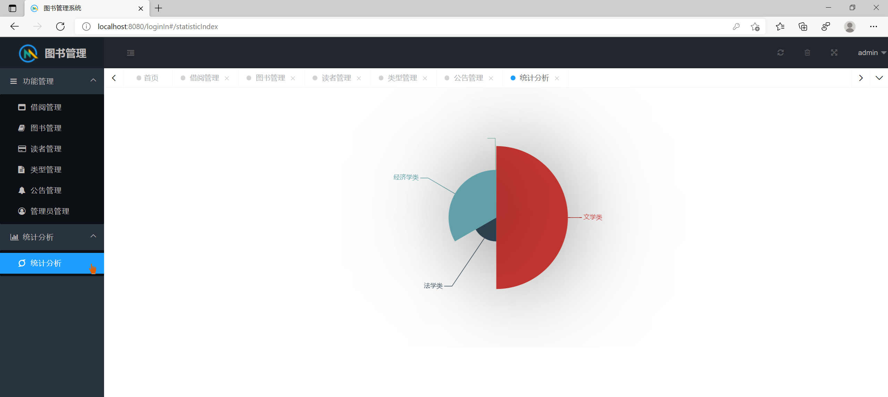
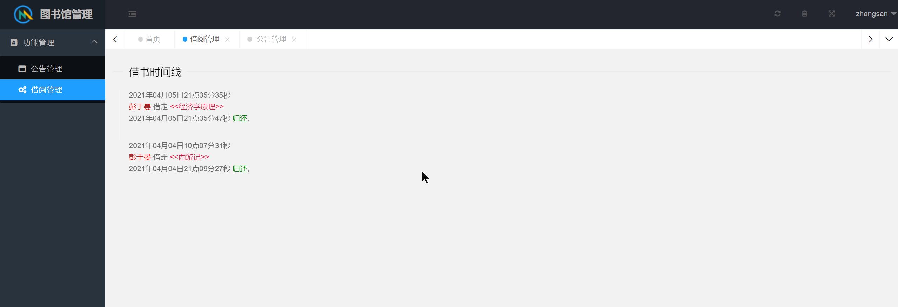

## 基于SSM的图书管理系统

###  获取sql数据库文件: 从戎源码网 (https://armycodes.com/) QQ: 386869957 QQ群: 377586148
###  所有系统地址: (https://github.com/YuLin-Coder/AllProjectCatalog) 
###  所有项目以及源代码本人均调试运行无问题 可支持远程安装部署调试、定制修改、代码讲解

## 项目介绍
基于SSM的图书管理系统，有读者和管理员两个角色，主要功能如下
1. 借阅管理：用于管理图书的借阅和归还，包括借书、还书、续借、借阅记录查询等功能。
2. 图书管理：用于管理图书的基本信息，包括书名、作者、ISBN、出版社、价格等，并支持图书的新增、修改、删除等操作。
3. 读者管理：用于管理读者的基本信息，包括姓名、学号/身份证号、联系方式等，并支持读者的注册、修改、删除等操作。
4. 公告管理：用于发布图书馆相关的公告通知，并支持公告的发布、修改、删除操作。
5. 图书类别管理：用于管理图书的分类信息，包括图书类别名称、编号等，并支持图书类别的新增、修改、删除等操作
6. 统计分析：用于对图书馆的借阅情况、读者数量、图书分类等进行统计和分析。

## 项目技术
- 编程语言：Java
- 数据库：MySQL
- 前端技术：JSP、Layui、Bootstrap、ECharts
- 后端技术：Spring、SpringMVC、MyBatis

## 运行环境
- JDK版本：JDK1.8及以上
- 开发工具：IDEA、Ecplise、Myecplise都可以
- 数据库: MySQL5.7及以上

## 运行截图

